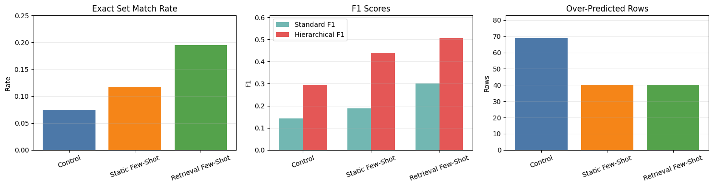
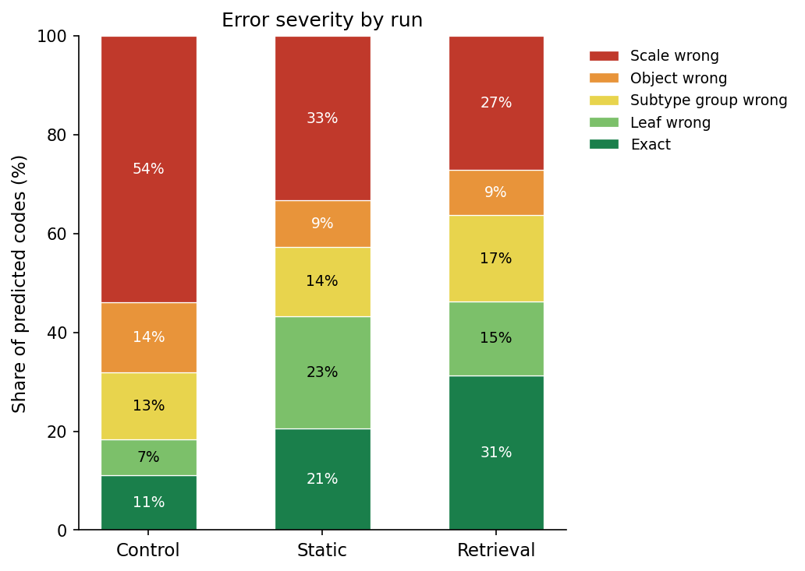

# Evaluating Qwen3-VL-8B on AVM Classification for Hubble Images

This project tests how well a small vision-language model can classify astronomical images. We use Qwen3-VL-8B and ask it to identify galaxies, nebulae, stars, clusters, and other structures in Hubble images.

We use the [ESA Hubble Deep Space Images](https://huggingface.co/datasets/Supermaxman/esa-hubble) dataset from Hugging Face and take the first 266 images from it. Each one comes with metadata describing what is in it.

## Dataset, AVM Labels, and Ground Truth

The dataset has many different astronomical objects, and we are not cosmology experts, so it is hard to judge by eye whether Qwen got an image right. Instead of deciding the labels ourselves, we use the dataset metadata as the ground truth.

The main metadata field we use is the `Type` column. Each image has a human-readable label in this column. For example:

```text
Local Universe : Galaxy : Type : Interacting
```

To make the comparison easier to measure, we convert these human-readable labels into AVM 1.1 taxonomy codes. AVM 1.1 is a hierarchical taxonomy for astronomical image metadata. Each code has a scale prefix, such as `A`, `B`, `C`, `D`, or `E`, followed by a taxonomy index like `4.1.2` or `5.1.1`.

For example:

```text
Local Universe : Nebula : Type : Star Formation   <=>   C.4.1.2

C       = Local Universe
4       = Nebula
4.1     = Nebula : Type
4.1.2   = Nebula : Type : Star Formation
```

Some images have more than one object type, so their ground truth contains multiple AVM codes. We store the converted labels in a true-code file with one row per image:

```text
0: B.3.6.4.1, B.4.1.3  (two objects)
1: C.5.1.7             (single object)
2: C.4.1.2
3: D.6.2.2
```


The row number matches the image index from the streamed dataset. Row `0` is the first image, row `1` is the second, and so on.

We also keep a separate AVM reference file. This file contains the AVM scale and taxonomy mapping. It is used for two things: converting the dataset labels into AVM codes, and giving Qwen the list of AVM codes it is allowed to use in the prompt.

So the evaluation setup becomes:

```text
Input: Hubble image
Model output: AVM code or codes
Ground truth: AVM code or codes converted from the dataset metadata
Evaluation: compare predicted AVM codes against ground-truth AVM codes
```
To keep the image and label lists consistent across all experiments, the notebook **streams** the dataset from Hugging Face and reads the first 266 rows. For each row, it stores the image, metadata, object name for retrieval filtering, and ground-truth AVM code. 

## Prompting Setup

The prompt is built to make the model output only AVM codes.

The system prompt has two parts: the AVM reference text and the task instruction. The reference text gives the model the taxonomy it can use, and the instruction tells it what to do with the image.

The main instruction is:

```text
You are an expert astronomical image classifier. Given an astronomical image,
identify the type(s) of object(s) or phenomenon(a) depicted and express each
as an AVM 1.1 code.
```

The model looks at each image and outputs only the code or codes. If an image has multiple object types, it outputs multiple codes separated by commas. The output format is the same as the ground-truth file.

Since Qwen can still add extra text, the notebook uses a regex to keep only strings that look like AVM codes and drops everything else. The kept codes go into a prediction file in the same `index: codes` format as the true-code file, so the metrics cell can compare the two directly.

## Experiments

We compare three settings.

1. Control / zero-shot. Qwen gets the AVM reference text and the task instruction only. No example image-label pairs.

2. Static few-shot. Qwen gets the same fixed 10 image-label examples for every test image. These work like a small training set inside the prompt.

3. Retrieval few-shot. Qwen gets 10 image-label examples picked for each test image using CLIP image similarity. So each image gets visually similar examples instead of the same fixed ones. The retrieval also skips any example that has the same object name as the test image, not just the test image itself. This stops it from grabbing another shot of the same Hubble object and copying its label.

All three runs use the same model, evaluation rows, parser, metrics, and greedy decoding. This isolates the prompting method as the main variable.

We used 266 images total. The 10 static few-shot examples are left out of evaluation, so the final evaluation is on 256 images.

The prediction files are:

```text
control_strict_codes_v1.txt
fewshot_10_strict_codes_v1.txt
retrieval_10_strict_codes_v1.txt
```

Each one holds Qwen's output for the same rows. The metrics cell reads these and compares them against the true AVM code file.

## Metrics

We use three metrics.

### Exact Set Match

This checks whether the predicted set of codes matches the ground-truth set exactly. 

### Standard Precision, Recall, and F1

This compares the predicted codes against the true codes. Precision is how many predicted codes were right, recall is how many true codes were found, and F1 combines the two. This one is useful because a lot of images have multiple labels.

$$
F1 = \frac{2 \cdot \text{Precision} \cdot \text{Recall}}{\text{Precision} + \text{Recall}}
$$

### Hierarchical Precision, Recall, and F1

AVM codes are hierarchical, so a prediction can be wrong at the exact subtype but still right at a broader level. To give credit for that, each code is expanded into all of its prefixes. `C.4.1.2` becomes `C`, `C.4`, `C.4.1`, `C.4.1.2`. We do this for the predicted codes and the true codes, then run the same precision, recall, and F1 on the expanded sets.


$$
hP = \frac{|A_{P} \cap A_{T}|}{|A_{P}|}, \quad hR = \frac{|A_{P} \cap A_{T}|}{|A_{T}|}, \quad hF1 = \frac{2 \cdot hP \cdot hR}{hP + hR}
$$

where $A_{P}$ and $A_{T}$ are the predicted and true code sets after expanding every code into its prefixes.

For example, if the true code is `C.4.1.2` (Star Formation nebula) and the model predicts `C.4.1.3` (Planetary nebula):

```text
expand(C.4.1.2) = {C, C.4, C.4.1, C.4.1.2}
expand(C.4.1.3) = {C, C.4, C.4.1, C.4.1.3}
overlap         = {C, C.4, C.4.1}   
```

Standard F1 here is 0, because `C.4.1.3` is not `C.4.1.2`, so the raw code sets do not overlap. Hierarchical F1 is 3/4 = 0.75, since the two codes match three of the four prefix levels. 

## Results

All three runs completed the same **256 evaluation rows**, so the completed rows and common rows are the same.

### Main Metric Summary

| Method | Exact Matches | Exact Rate | Macro Precision | Macro Recall | Macro F1 | Hierarchical F1 | Over-Predicted Rows |
|---|---:|---:|---:|---:|---:|---:|---:|
| **Control** | 19 / 256 | 0.0742 | 0.1635 | 0.1445 | 0.1436 | 0.2947 | 69 |
| **Static few-shot** | 30 / 256 | 0.1172 | 0.1943 | 0.1992 | 0.1884 | 0.4390 | 40 |
| **Retrieval few-shot** | 50 / 256 | **0.1953** | **0.3242** | **0.3047** | **0.3014** | **0.5068** | 40 |

The retrieval few-shot run has the best exact match rate, macro F1, and hierarchical F1.

### Metric Graph


<!-- figure: bar chart comparing exact match rate, macro F1, and hierarchical F1 across control, static few-shot, and retrieval few-shot -->

### Helped and Hurt Rows

We also compare each few-shot run against the control row by row.

| Comparison | Better Than Control | Worse Than Control |
|---|---:|---:|
| Static few-shot vs control | 38 rows | 21 rows |
| Retrieval few-shot vs control | 64 rows | 18 rows |

Retrieval few-shot helped more rows and hurt fewer rows than static few-shot. This supports the main metric results.

### Error Severity

For every predicted code we measured where it first diverges from the true code in the AVM tree. A code splits into scale, object, subtype group, and leaf, and the match depth is how many of those levels a prediction shares with the truth before it goes wrong. Any predicted code that is not a real AVM code is counted as invented.

| Severity | Control | Static | Retrieval |
|---|---:|---:|---:|
| Invented | 0.0% | 0.0% | 0.0% |
| Scale wrong | 54.0% | 33.3% | 27.1% |
| Object wrong | 14.2% | 9.3% | 9.2% |
| Subtype group wrong | 13.5% | 14.0% | 17.5% |
| Leaf wrong | 7.2% | 22.7% | 14.9% |
| Exact | 11.2% | 20.6% | 31.4% |



## Analysis

The control result is low. Qwen got 19 out of 256 images exactly right. With only the taxonomy and the instruction, the model does poorly on AVM classification.
 
Static few-shot improved every metric. **Exact matches** went from 19 to 30, **Macro F1** from 0.1436 to 0.1884, and **Hierarchical F1** from 0.2947 to 0.4390. The fixed example pairs helped the model follow the AVM output format and label style.
 
Retrieval few-shot scored highest. **Exact matches** rose to 50, **Macro F1** to 0.3014, and **Hierarchical F1** to 0.5068. Visually similar examples were more useful than the same fixed examples.
 
Over-prediction dropped under both few-shot settings. The control over-predicted on 69 rows. Static and retrieval each over-predicted on 40. The examples reduced how often the model output too many codes.
 
**Exact match** and **Hierarchical F1** differ across all three runs. Exact match gives no credit when the broad object type is right but the subtype is wrong. Hierarchical F1 is higher because the predictions often match the upper levels of the tree even when the final code is wrong.
 
No run invented codes. Every code the model produced is a real AVM code, so the failure is not fabrication. The model usually picks a wrong real code, not a made-up one.

The largest error type is scale error, not fine subtype error. In the control run, $54.0\%$ of predicted codes had the wrong scale, meaning the model confused broad regimes such as Milky Way, Local Universe, or Early Universe. This makes sense because the image can show the object shape, but the cosmic distance is often not obvious visually.

Few-shot prompting reduced these scale errors. Static few-shot lowered scale errors to $33.3\%$, and retrieval few-shot lowered them to $27.1\%$. The exact-code share also increased from $11.2\%$ in control to $20.6\%$ in static few-shot and $31.4\%$ in retrieval few-shot. This suggests that examples help guide the model toward the right AVM region, especially when the visual evidence alone is not enough.

Overall, Qwen can classify these images to a degree, but it struggles with fine-grained AVM labeling and especially with choosing the correct scale. Both few-shot settings beat the control, and retrieval beat static.

## Limitations

- The task is fine-grained. A lot of AVM labels look similar, especially galaxy and nebula subtypes. Even when the model knows it is a galaxy, it can pick the wrong galaxy subtype.

- Many images have multiple labels. The model might get one object right and miss another, or add an extra label that looks visually possible but is not in the metadata.

- The ground truth comes from metadata, which can include scientific context that is not obvious from the image. This makes the task harder for a vision-language model.

- The retrieval method depends on CLIP similarity. If CLIP pulls examples that look similar but are actually a different type, the prompt can still push Qwen toward the wrong code.

## Conclusion

We tested Qwen3-VL-8B on AVM classification for ESA/Hubble images. The zero-shot control reached an **exact match** rate of $7.42\%$. Static few-shot raised it to $11.72\%$, and retrieval few-shot did the best at $19.53\%$.

The **F1** scores follow the same pattern. **Macro F1** went 0.1436, 0.1884, 0.3014. **Hierarchical F1** went 0.2947, 0.4390, 0.5068.

So Qwen3-VL-8B can make useful AVM predictions, but it is not reliable enough for exact fine-grained astronomical classification on its own. Few-shot prompting helps, and retrieval-based few-shot helps the most.
